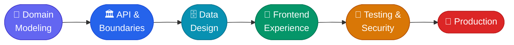

# Vinayak Saxena

 

 

## 👋 About Me

I build **production-grade applications and business systems**, working across **backend engineering, full-stack development, FinTech, security, and enterprise platforms**.

I like owning the full path: **domain modeling → API design → database architecture → frontend → deployment**, and keeping the system maintainable and easy to extend.

 

## 🧭 Journey

| | |
|---|---|
| 💼 **Full-Stack Developer** · Pivraam Consulting *(Remote)* | Aug 2025 → Present |
| 🎓 **MCA** · GL Bajaj Institute of Technology & Management, Greater Noida | Completed 2025 |

 

## 🧰 Tech Stack

| | |
|---|---|
| **⚙️ Backend** |       |
| **🎨 Frontend** |      |
| **🗄️ Data** |     |
| **🔎 Search & Observability** |     |
| **🐳 DevOps & Tooling** |       |
| **🔐 Security** |     |
| **🤖 AI & Automation** |   |

 

## 🚀 What I Build

<table>
<tr>
<td width="50%" valign="top">

### 💳 FinTech Systems
Payment processing, account management, settlement, pricing, velocity controls, reporting, and admin operations.

**Focus:** correctness, traceability, security, and domain models that last.

</td>
<td width="50%" valign="top">

### 🛡️ GRC & Compliance
Enterprise platforms covering frameworks, control libraries, risk assessments, evidence, findings and remediation, **Third-Party Risk Management**, vendor management, and maker-checker approvals.

</td>
</tr>
<tr>
<td width="50%" valign="top">

### 🔐 Identity & Access
Internal and external users, RBAC with custom roles and groups, JWT auth, MFA, password reset, user lifecycle, and vendor onboarding.

</td>
<td width="50%" valign="top">

### 🧩 Full-Stack Applications
`Next.js` · `React` · `TypeScript` · `Spring Boot` · `PostgreSQL`

Reusable components, clean API boundaries, RBAC-aware dashboards, i18n, and maintainable monorepos.

</td>
</tr>
</table>

 

## 🔄 How I Ship

 

## 🏗️ Engineering Principles

| Principle | In practice |
|---|---|
| 🧠 **Domain first** | Understand the problem before writing code |
| 🏛️ **Clear boundaries** | Define module and service boundaries before adding complexity |
| 🔐 **Security by design** | Treat authentication and authorization as first-class concerns |
| 🗄️ **Data integrity** | Model data for correctness and long-term change |
| 🧩 **Reusability** | Prefer shared components over duplicated logic |
| 🧪 **Meaningful tests** | Validate behavior, not just coverage numbers |
| 📦 **Modularity** | Keep architecture modular and maintainable |
| 🚀 **Production-ready** | Build for production, not just for demos |

 

## ⭐ Featured Projects

<table>
<tr>
<td width="50%" valign="top">

### 🛡️ Project Name
*One-line description of what it does and who it's for.*

**Highlights:** key feature · key feature · key feature

[View repository →](https://github.com/vinayaksaxena13)

</td>
<td width="50%" valign="top">

### 💳 Project Name
*One-line description of what it does and who it's for.*

**Highlights:** key feature · key feature · key feature

[View repository →](https://github.com/vinayaksaxena13)

</td>
</tr>
</table>

 

## 📌 Current Focus

 

## 📈 Always Learning

 

## 💬 Philosophy

> *"Good software is secure, understandable, and built to evolve."*

 

## 🤝 Let's Connect

I'm always happy to talk about **backend architecture, FinTech, security, and building maintainable products.**

  

